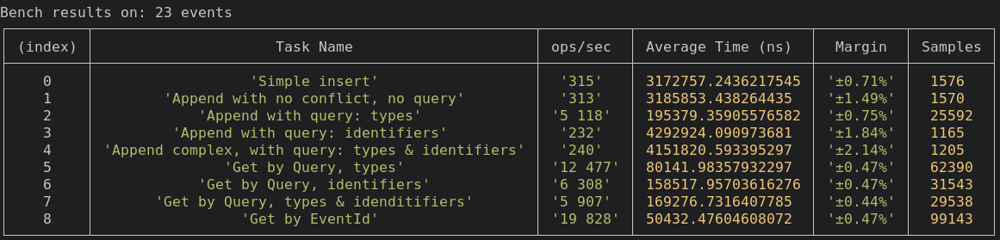
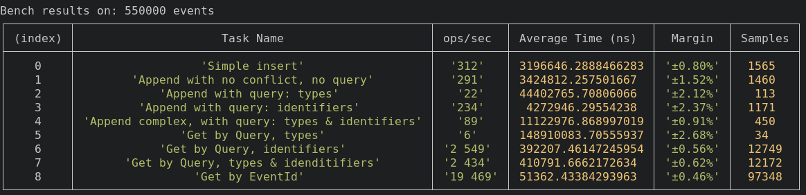

<div align="center">
	<br/>
	
	<br/>
	<br/>
</div>

Library to do event sourcing while keeping the focus on events and not on aggregates.

Inspired by this talk: https://www.youtube.com/watch?v=0iP65Durhbs

## Table of Contents

- [Installation](#installation)
- [Usage](#usage)
- [Features](#features)
- [API](#api)
- [Development](#development)
- [Testing](#testing)
- [Benchmark](#benchmark)

## Installation

### Npm

```bash
npm install sorci --save
```

### Yarn

```bash
yarn add sorci
```
## Usage

The idea was to be able to do Full Event Sourcing without the need of an event store.
So for now there is only one implementation of Sorci => SorciPostgres.
Maybe other implementation will be done later.
This library has never been used in production yet. Use at your own risk :)

```typescript
import { SorciPostgres } from "sorci";

const host = "localhost";
const port = 54322;
const user = "postgres";
const password = "postgres";
const database = "postgres";
const streamName = "Your-Stream-Name";

const sorci = new SorciPostgres(
	host,
	port,
	user,
	password,
	database,
	streamName
);

// This will create everything needed to persist the events properly
await sorci.createStream();


// Small exemple of adding an Event with no impact (No concurrency issue)
await sorci.appendEvent({
	id: "0a19448ba362",
	type: "todo-item-created",
	data: {
		todoItemId: "0a19448ba362",
		text: "Create the Readme of Sorci.js",
	},
	identifier: {
		todoItemId: "0a19448ba362",
	},
});
```

## Features

The library create 2 tables:

* 1 writable
* 1 read-only

The writable table act as an append log. The read-only is a synchronize copy of the writable table.

### Why two tables ? 

It's a technical constraint. To make sure an event can be persisted the library completely lock the writable table.
Wich mean it's also unreadable during write. The read-only table allow read while event are beeing persisted.

## API

Full References - [here](https://sraleik.github.io/sorci/)

## Testing

Unit test are testing proper appending, specialy focus on concurrency issues.

```bash
yarn run test:unit
```

## Benchmark

Performance vary with volume of events in the stream.
But for most application it should not be a problem.

Those benchmark are done on a dell xps pro.





### **Simple Insert :**
<small>~300 ops/s</small>

This is for reference. To know the baseline of Insert.

### **Simple Append :**
<small>~300 ops/s</small>

This is when we want to persist an event that we know don't impact decision.
The library will be very close to baseline. It's almost a simple insert.

### **Append with query - types :**

Here we have a big variation, in the first exemple there is only 2 event of the selected type `course-created`, so getting the lastVersion is fast

In the second exemple we have 55 000 event of types `course-created` it take a bit longer to get the lastVersion

This should not be a big issue because filtering only by types should not happen very often. The option remain available if necessary

### **Append with query - identifiers :**
<small>~230 ops/s</small>

Here volume should not impact the persistence. Identifier has a gin index. Wich make retrieving event by id fast. 

This is great because it will be one of the most use way of persisting event.

### **Append with query - types & identifiers :**

Here volume is impacting the results. But performance are for most cases acceptable. On a benchmark with 1M events the library still score a 50 ops/s

### **Get by Query - type :**

Here volume is important, in the second exemple we are retrieving 55 000 events whereas in the first we retrieve 2.

### **Get by Query - identifier :**

Here volume is important, 
In those exemple we retrieve the same amount of event but going through the btree index is a bit slower since there is more data. 

Perfomance should be good for most cases

### **Get by Query - types & identifier :**

Here volume is important, 
In those exemple we retrieve the same amount of event but going through the btree & gin index is a bit slower since there is more data. 

Perfomance should be good for most cases

### **Get by EventId :**
<small>~20 000 ops/s</small>

This is for reference. To know the baseline Query.

</br>

### **To run the bench mark**

Requirement: Docker installed

```bash
yarn run bench
```

It will take around 30s ~ to load the half a million event into the table.

## TODO

- [X] Auto generate the API reference 
- [X] Display the API with github page 
- [ ] Fix eslint
- [ ] Add option to serialize data into binary
- [ ] Make the constructor parameter a single explicit payload
- [ ] Add a appendEvents 
- [ ] Make the github CI run the unit test 
- [ ] Make the github CI run the benchmark 
- [ ] Make the github CI generate a new version when merged on trunk 
