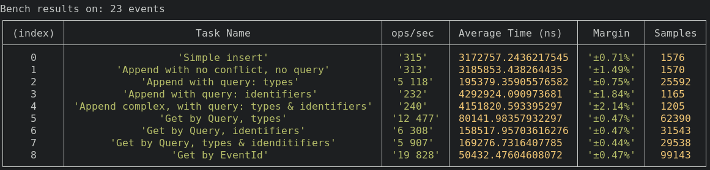
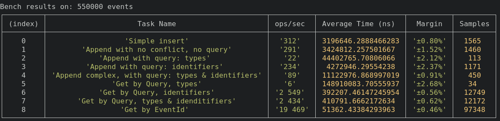

<div align="center">
  <br/>
  
  <br/>
  <br/>
</div>

This is an implementation attempt to Dynamic Consistency Boundary (DCB) with typescript & postgres.
Described by Sara Pellegrini & Milan Savic : https://www.youtube.com/watch?v=0iP65Durhbs

## Table of Contents

- [Installation](#installation)
- [Usage](#usage)
- [Technical Explanation](#technical-explanation)
- [API](#api)
- [Tutorial](#tutorial)
- [Testing](#testing)
- [Benchmark](#benchmark)

## Installation

### Npm

```bash
npm install sorci --save
```

### Yarn

```bash
yarn add sorci
```

## Usage

The idea was to be able to do DCB without the need of an event store.
So for now there is only one implementation of Sorci => SorciPostgres.
Maybe other implementation will be done later.
This library has never been used in production yet. Use at your own risk :)

### Initialization

```typescript
import { Sorci, SorciPostgres } from "sorci";

const sorci: Sorci = new SorciPostgres({
  host: "localhost",
  port: 54322,
  user: "postgres",
  password: "postgres",
  databaseName: "postgres",
  streamName: "Your-Stream-Name",
});

// This will create everything needed to persist the events properly
await sorci.createStream();
```

### Appending Events

```typescript
// Small exemple of adding an Event with no impact (No concurrency issue)
await sorci.appendEvent({
  sourcingEvent: {
    type: "todo-item-created",
    data: {
      todoItemId: "0a19448ba362",
      text: "Create the Readme of Sorci.js",
    },
    identifier: {
      todoItemId: "0a19448ba362",
    },
  },
});

// Small exemple of adding an Event with query
await sorci.appendEvent({
  sourcingEvent: {
    type: "todo-item-name-updated",
    data: {
      todoItemId: "0a19448ba362",
      previousText: "Create the Readme of Sorci.js",
      newText: "Improve the Readme of Sorci.js",
    },
    identifier: {
      todoItemId: "0a19448ba362",
    },
  },
  query: {
    $where: {
        type: "todo-item-created",
        identifiers: {
            todoItemId: "0a19448ba362",
        },
    }
  },
  lastKnownEventId: "48efa9d568d3",
});
```

### Projections

You can create projections to have a read model of your events.

```typescript
// Create a projection
await sorci.createProjection({
  name: "todo-list",
  schema: {
    id: { type: "text", primaryKey: true },
    count: { type: "integer", default: 0 },
  },
});

// Define how events update the projection
await sorci.setEventReducingToProjection({
  name: "todo-list",
  eventType: "todo-item-created",
  reducer: (sql, tableName) => {
    return sql`
      INSERT INTO ${sql(tableName)} (id, count)
      VALUES (
        event.identifier->>'todoItemId',
        1
      )
      ON CONFLICT (id) DO UPDATE
      SET count = ${sql(tableName)}.count + 1
    `;
  },
});

// Query the projection
const results = await sorci.queryProjection("todo-list");
```

### Reducing

You can also compute state on the fly using reducers.

```typescript
import { getAggregateByQueryFactory } from "sorci";

const getAggregate = getAggregateByQueryFactory(
  (query) => sorci.getEventsByQuery(query)
);

const query = {
  $where: {
    type: { $in: ["todo-item-created", "todo-item-name-updated"] }
  }
};

const { state } = await getAggregate(query, (currentState, event) => {
    // Your reduction logic here
    return { ...currentState, ...event.data };
});
```

## Technical Explanation

The library creates a single table to store events.

### Concurrency Control

The library uses **Postgres Advisory Locks** (`pg_advisory_xact_lock`) to handle concurrency.
Instead of locking the whole table or a specific row, it locks a "concept" defined by your query.

When you append an event with a query (to check for consistency), the library:
1.  Analyzes your query to extract **identifiers** and **event types**.
2.  Generates a unique hash based on these criteria.
3.  Acquires a transaction-level advisory lock on this hash.

This effectively creates a **Dynamic Consistency Boundary**.
-   If two processes try to append an event affecting the same "aggregate" (e.g., same `todoItemId`), one will wait for the other.
-   If they affect different parts of the system, they run in parallel.
-   This avoids the need for a strict "Aggregate" pattern while maintaining consistency where it matters.

## API

Full References - [here](https://sraleik.github.io/sorci/)

## Tutorial

[Create a Command](https://sraleik.github.io/sorci/pages/tutorial/create-a-command.html)

## Testing

Unit test are testing proper appending, specialy focus on concurrency issues.

```bash
yarn run test:unit
```

## Benchmark

Since the table where the event are persisted is locked during write.
My main concern was performance. So I did some benchmark to see how it perform.

Performance vary with volume of events in the stream.
But for most application it should not be a problem.

Every benchmark is run for 5s with 23 events and 500 000~ events.
Those benchmark are done on a dell xps pro, they also run in the CI.





### **Simple Insert**

<small>~300 ops/s</small>

This is for reference. To know the baseline of Insert.

### **Simple Append**

<small>~300 ops/s</small>

This is when we want to persist an event that we know don't impact decision.
The library will be very close to baseline. It's almost a simple insert.

### **Append with query - types**

Here we have a big variation, in the first exemple there is only 2 event of the selected type `course-created`, so getting the lastVersion is fast

In the second exemple we have 55 000 event of types `course-created` it take a bit longer to get the lastVersion

This should not be a big issue because filtering only by types should not happen very often. The option remain available if necessary

### **Append with query - identifiers**

<small>~230 ops/s</small>

Here volume should not impact the persistence. Identifier has a gin index. Wich make retrieving event by id fast.

This is great because it will be one of the most use way of persisting event.

### **Append with query - types & identifiers**

Here volume is impacting the results. But performance are for most cases acceptable. On a benchmark with 1M events the library still score a 50 ops/s

### **Get by Query - type**

Here volume is important, in the second exemple we are retrieving 55 000 events whereas in the first we retrieve 2.

### **Get by Query - identifier**

Here volume is important,
In those exemple we retrieve the same amount of event but going through the btree index is a bit slower since there is more data.

Perfomance should be good for most cases

### **Get by Query - types & identifier**

Here volume is important,
In those exemple we retrieve the same amount of event but going through the btree & gin index is a bit slower since there is more data.

Perfomance should be good for most cases

### **Get by EventId**

<small>~20 000 ops/s</small>

This is for reference. To know the baseline Query.

</br>

### **To run the bench mark**

Requirement: Docker installed

```bash
yarn run bench
```

It will take around 30s ~ to load the half a million event into the table.

## Acknowledgment

I've be figthing aggregate for a while now. Sometimes it really feel like trying to fit a square into a circle.
The approache of Sara Pellegrini & Milan Savic (DCB) solve the concurrency issue I had with an event only approach.
There conference talk is really great and explain the concept so well that this implementation was possible I highly recommend it : https://www.youtube.com/watch?v=0iP65Durhbs

## Contributions

I'm really curious to get feedback on this one. Feel free to start/join a discussion, issues or Pull requests.

## TODO

### Feature

- [ ] Add a appendEvents
- [ ] Add a mergeStreams
- [ ] Add a splitStream
- [x] Add a way to be able to inject a createId function to SorciEvent
- [x] Add Projections support
- [x] Add Reducing support

### Documentation

- [ ] Do Explanation/postgres-stream.md

### Technical

- [x] Make the constructor parameter a single explicit payload
- [ ] Add option to serialize data into binary
- [x] Rename clean/clear en dropStream

### Repository

- [x] Use npm version to publish new version
- [x] Fix eslint
- [x] Make a github workflow to create a new release
- [ ] Version the Api Doc with multiple folder
- [ ] Add eslint workflow on new-release 
- [x] Update documentation only when there is a diff
- [x] Remove dependency to uuid (make it possible to give a createId function to SorciEvent)
- [x] Make the github CI run the unit test
- [x] Make the github CI run the benchmark
- [x] Auto generate the API reference
- [x] Display the API with github page

## Tweet

Thrilled to share a new #typescript library I've been working on. Implementing #DynamicConsistencyBoundary from @_sara_p_ & @MilanSavic14 #killAggregate #DCB.🌐 I would love your feedback on it: https://github.com/Sraleik/sorci